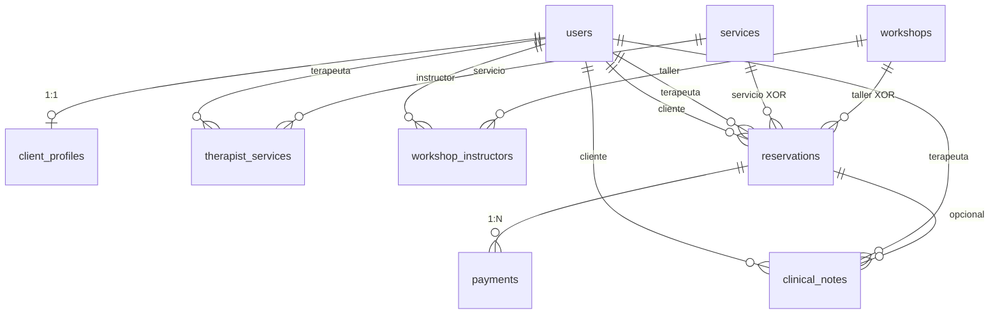

# Schema Overview — Plataforma de Sanación Holística

Esquema PostgreSQL para la gestión de clientes, servicios terapéuticos, talleres/eventos, reservas con pagos integrados, e historial clínico.

## Archivos SQL (ejecutar en orden)

| Archivo | Tablas | Descripción |
|---|---|---|
| `01_users.sql` | `users`, `client_profiles` | Autenticación, roles y perfil clínico del cliente |
| `02_services.sql` | `services`, `therapist_services` | Catálogo de servicios y asignación de terapeutas |
| `03_workshops.sql` | `workshops`, `workshop_instructors` | Talleres grupales con co-facilitadores |
| `04_reservations.sql` | `reservations` | Motor unificado de reservas (servicio XOR taller) |
| `05_payments.sql` | `payments` | Pagos con columna generada `pending_amount` |
| `06_clinical_notes.sql` | `clinical_notes` | Notas privadas del terapeuta por cliente |

## Diagrama de Relaciones

## Relaciones Detalladas

### `users` → centro del esquema
- **1:1** con `client_profiles` (solo rol `client`)
- **N:M** con `services` a través de `therapist_services`
- **N:M** con `workshops` a través de `workshop_instructors`
- **1:N** con `reservations` (como cliente y como terapeuta)
- **1:N** con `clinical_notes` (como cliente y como terapeuta)

### `reservations` → motor unificado
- FK a `services` **XOR** `workshops` (CHECK de exclusividad)
- **1:N** con `payments` (soporta pagos parciales)
- **1:N** con `clinical_notes` (FK opcional, para notas de evolución)

## Convenciones Aplicadas

| Convención | Detalle |
|---|---|
| **Primary Keys** | UUID con `gen_random_uuid()` |
| **Timestamps** | `created_at`, `updated_at` (TIMESTAMPTZ) en todas las tablas |
| **Soft Delete** | `deleted_at` (TIMESTAMPTZ, nullable) en todas las tablas |
| **Índices** | Máximo 2-3 por tabla, optimizados para los queries más frecuentes |
| **ON DELETE** | SET NULL para preservar historial; CASCADE solo en relaciones de composición (client_profiles, pivotes) |

## Estrategia ON DELETE por Tabla

| Tabla | FK | Estrategia | Razón |
|---|---|---|---|
| `client_profiles` | `user_id` | CASCADE | El perfil no tiene sentido sin el usuario |
| `therapist_services` | `therapist_id`, `service_id` | CASCADE | Relación de asignación, no historial |
| `workshop_instructors` | `workshop_id`, `instructor_id` | CASCADE | Relación de asignación, no historial |
| `reservations` | `client_id` | SET NULL | Preservar historial de reservas |
| `reservations` | `therapist_id` | SET NULL | Preservar historial de reservas |
| `reservations` | `service_id`, `workshop_id` | SET NULL | Preservar historial de reservas |
| `payments` | `reservation_id` | CASCADE | El pago no tiene sentido sin la reserva |
| `clinical_notes` | `client_id` | CASCADE | La nota no tiene sentido sin el paciente |
| `clinical_notes` | `therapist_id` | SET NULL | Preservar nota si el terapeuta se va |
| `clinical_notes` | `reservation_id` | SET NULL | Nota puede existir sin sesión |
